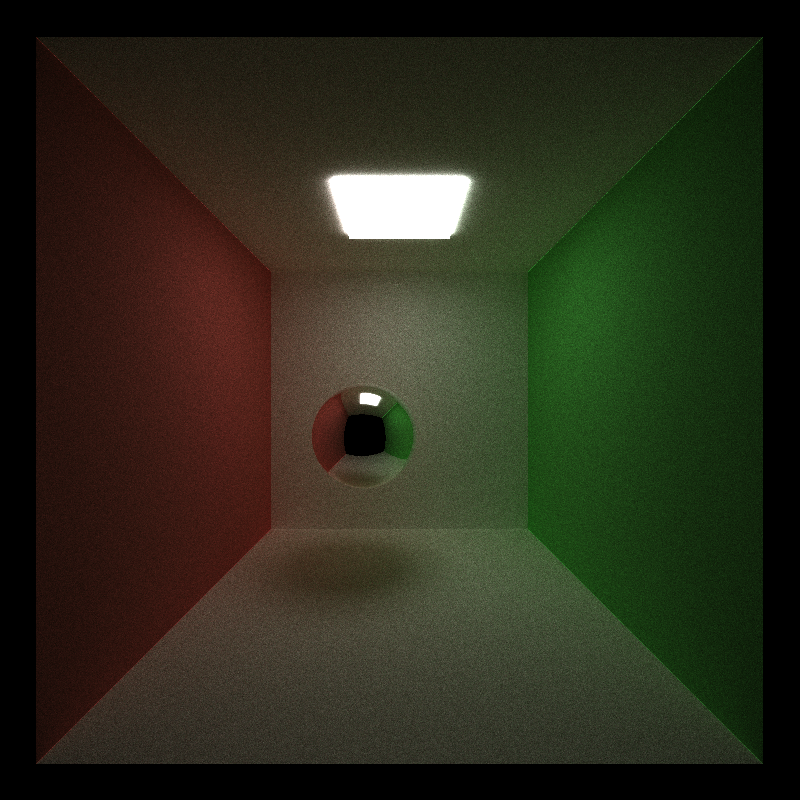
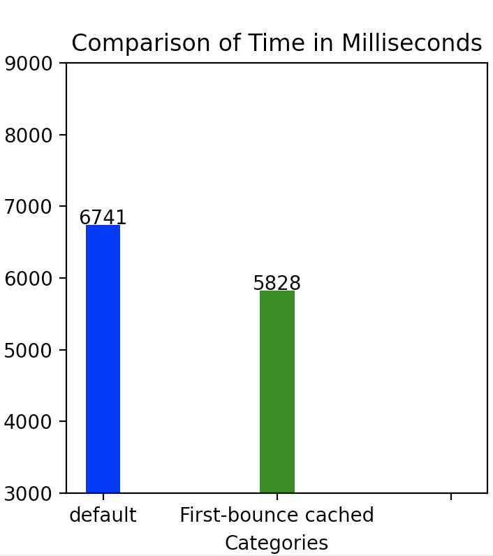

# Cuda Path Tracer

A hardware-accelerated Monte Carlo path tracer designed for performance and efficiency global illuminated-rendering.

## Key Performance Features:
- Parallel ray-material shading on GPU.
- Ray path termination with Stream Compaction.
- First Ray intersection cache.
- Ray sort by material in memory.

## Performance Improvement Measures:
*Configurations for Testing*:
- Scene: Cornell box
- Camera Resolution: 800x800 pixels
- Samples rate: 64 samples per camera pixel
- Tested Environment: Windows 11, RTX 4090, Intel i5-13600kf @5GHz

Render time is measured in milliseconds.

## Ongoing Features:
- [x]  First Ray intersection cache.
- [ ] Import custom models with glTF format
- [ ] Anti-aliasing
